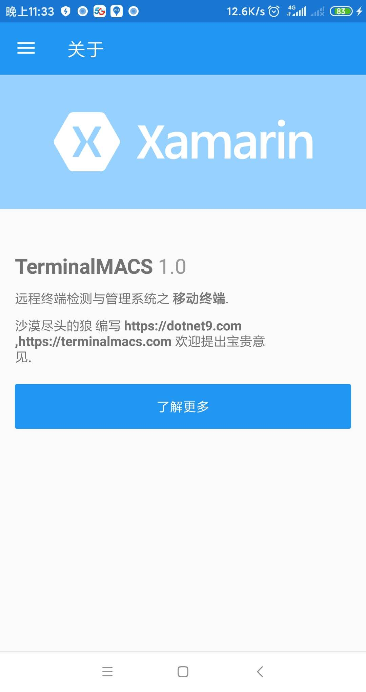

# TerminalMACS(Terminal Manager And Check System)
# 远程终端管理和检测系统
## 一、本系统可监控多种终端资源：

移动端
- Android
- iOS

PC端
- Windows
- Linux
- Mac

## 二、整个系统分为三类进程：

1. 被控端(Client)

被控端用于获取终端数据，如手机的通讯录、通话记录等，windows终端的文件系统，linux终端的进程列表等，共5个进程，包括：
- 移动被控端（Android、iOS）；
- PC被控端(Windows、Linux、Mac)。

2. 服务端(Server)

用于与被控端和管理端数据中转，包括获取被控端数据、向被控端发送命令、向管理端发送数据等，1个进程。

3. 管理端(Manager)

用于监视被控端，展示被控端数据、命令交互等，共6个进程，包括：
- 移动管理端（Android、iOS）；
- PC管理端(Windows、Linux、Mac)；
- B/S管理端。

三类进程共12个，即12个子模块（或子系统）。

## 三、各子模块技术栈

1. 被控端(Client)
- 移动被控端（Android、iOS）：xamarin.forms + sqlite。
- PC被控端(Windows、Linux、Mac)：C# 控制台。

2. 服务端

.NET 5 WEB API + Entity Framework Core(MySql）+ Redis + RabbitMQ。

3. 管理端
- 移动管理端（Android、iOS）：flutter + sqlite。
- PC管理端(Windows)：C# + WPF。
- PC管理端(Linux、Mac)：C++ + Qt Quick。

## 四、开发进度
2020-03-21
项目才计划不久，先开发移动被控端基本功能：
1. 获取通讯录数据
参考文章：[Getting phone contacts in Xamarin Forms](https://www.xamboy.com/2019/10/10/getting-phone-contacts-in-xamarin-forms/)

参考上面的文章，Android获取通讯录功能已经完成大部分（获取所有通讯录信息并展示），iOS由于没有相关环境，iOS代码是已经添加了，只是未测试，有条件的同学可以帮忙测试下。

下面是部分截图，稍作整理，出篇文章介绍获取通讯录功能代码，大部分是参考上面的文章。

本项目源码已经开源：https://github.com/dotnet9/TerminalMACS